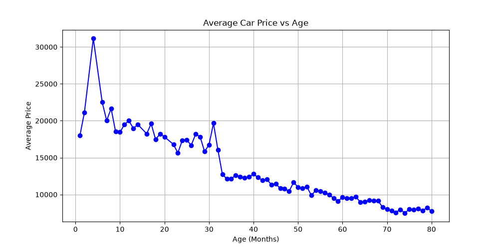

# 📈 Day 01 - Line Plot

## 🎯 Objective

Learn how to create a basic Line Plot using Matplotlib by visualizing the relationship between the average price and age of Toyota cars.

---

## 📚 Topics Covered

- Reading a CSV file using Pandas
- Handling missing values using `dropna()`
- Grouping data using `groupby()`
- Calculating average values using `mean()`
- Sorting values using `sort_index()`
- Creating a Line Plot using Matplotlib
- Adding chart title, axis labels, and grid

---

## 🛠 Libraries Used

- Pandas
- Matplotlib

---

## 📂 Dataset

**Toyota.csv**

---

## 💻 Python Code

**File:** `line_plot.py`

### Steps Performed

1. Loaded the Toyota dataset.
2. Removed missing values.
3. Grouped the data by the `Age` column.
4. Calculated the average `Price` for each age.
5. Plotted the results using a line graph.
6. Added a title, axis labels, and grid.

---

## 📊 Output

---

## 📖 Observation

From the graph, it can be observed that the average price of Toyota cars generally decreases as the age of the car increases. Some fluctuations are present, but the overall trend shows depreciation with age.

---

## 📌 What I Learned Today

- How to read datasets using Pandas.
- How to clean data using `dropna()`.
- How to summarize data using `groupby()`.
- How to calculate averages using `mean()`.
- How to create a basic Line Plot with Matplotlib.
- How to customize a graph with a title, labels, and a grid.

---

## 📅 Day 01 Status

✅ Completed
