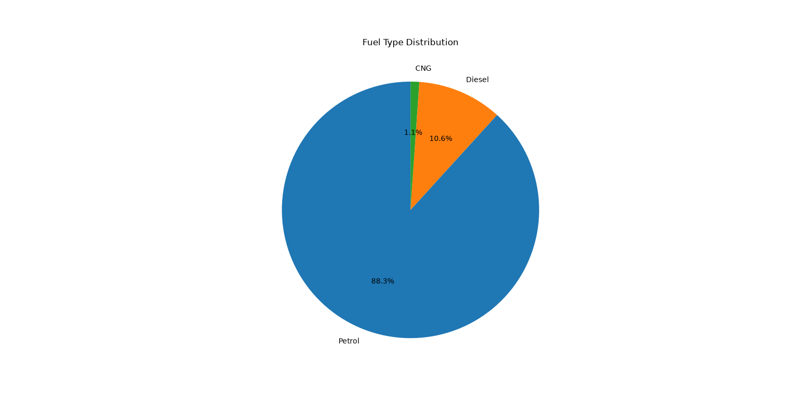

# 🥧 Day 04 - Pie Chart

## 🎯 Objective

Learn how to create a Pie Chart using Matplotlib to visualize the distribution of different fuel types in the Toyota dataset.

---

## 📚 Topics Covered

- Reading a CSV file using Pandas
- Removing missing values using `dropna()`
- Counting category frequencies using `value_counts()`
- Creating a Pie Chart using Matplotlib
- Displaying percentages using `autopct`
- Rotating the chart using `startangle`

---

## 🛠 Libraries Used

- Pandas
- Matplotlib

---

## 📂 Dataset

Toyota.csv

---

## 💻 Python Code

**File:** `pie_chart.py`

### Steps Performed

1. Loaded the Toyota dataset.
2. Removed missing values.
3. Counted the number of cars for each fuel type.
4. Created a pie chart to show the distribution.
5. Displayed percentage values for each category.

---

## 📊 Output

---

## 📖 Observation

The pie chart represents the proportion of different fuel types in the Toyota dataset. It clearly shows which fuel type has the highest number of cars and how the remaining fuel types are distributed.

---

## 📌 What I Learned Today

- How to create a Pie Chart using Matplotlib.
- How to use `value_counts()` to summarize categorical data.
- How to display percentages using `autopct`.
- How to rotate a pie chart using `startangle`.
- How pie charts help visualize proportions.

---

## 📅 Day 04 Status

✅ Completed
