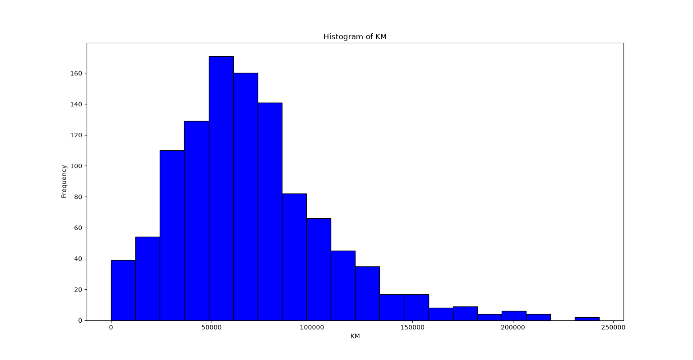

# 📊 Day 05 - Histogram

## 🎯 Objective

Learn how to create a Histogram using Matplotlib to understand the distribution of the Age column in the Toyota dataset.

---

## 📚 Topics Covered

- Reading a CSV file using Pandas
- Removing missing values using `dropna()`
- Creating a Histogram using Matplotlib
- Using the `bins` parameter
- Understanding frequency distribution

---

## 🛠 Libraries Used

- Pandas
- Matplotlib

---

## 📂 Dataset

Toyota.csv

---

## 💻 Python Code

**File:** `histogram.py`

### Steps Performed

1. Loaded the Toyota dataset.
2. Removed missing values.
3. Selected the `Age` column.
4. Created a histogram.
5. Added chart title and axis labels.

---

## 📊 Output

---

## 📖 Observation

The histogram shows how the ages of Toyota cars are distributed in the dataset. Each bar represents the number of cars that fall within a specific age range. Taller bars indicate age ranges with more cars.

---

## 📌 What I Learned Today

- How to create a Histogram using Matplotlib.
- How the `bins` parameter affects the chart.
- How to visualize the distribution of numerical data.
- How to interpret the frequency of values.

---

## 📅 Day 05 Status

✅ Completed
