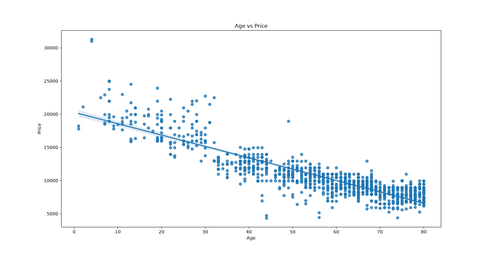
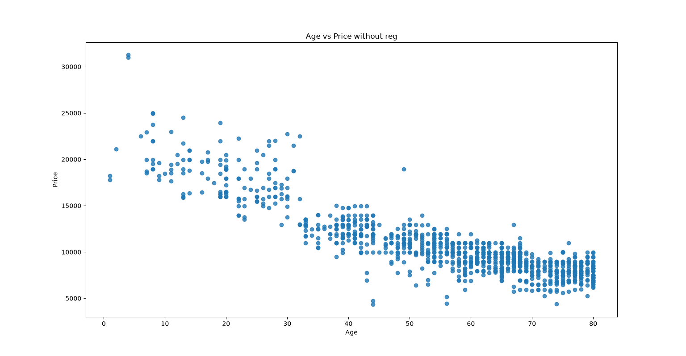

# 📊 Day 06 - Seaborn Regplot

## 🎯 Objective

Learn how to create a regression plot using Seaborn and understand the difference between a plot with and without a regression line.

---

## 📚 Topics Covered

- Introduction to Seaborn
- `sns.regplot()`
- Regression line
- `fit_reg=False`
- Visualizing the relationship between two variables
- Comparing regression and non-regression plots

---

## 🛠 Libraries Used

- Pandas
- Matplotlib
- Seaborn

---

## 📂 Dataset

Toyota.csv

---

## 💻 Python Code

**File:** `regplot.py`

Two regression plots were created using the `Age` and `Price` columns.

### 1. With Regression Line

```python
sns.regplot(x=df['Age'], y=df['Price'])
```

This creates a scatter plot along with a regression line.

### 2. Without Regression Line

```python
sns.regplot(
    x=df['Age'],
    y=df['Price'],
    data=df,
    fit_reg=False
)
```

Setting `fit_reg=False` removes the regression line and displays only the data points.

---

## 📊 Output

### With Regression Line



### Without Regression Line



---

## 📖 Observation

The regression plot shows the relationship between the age and price of Toyota cars along with a regression line.

The second plot uses `fit_reg=False`, so only the individual data points are displayed without the regression line.

---

## 📌 What I Learned Today

- How to use Seaborn's `regplot()`.
- How a regression line can help visualize the relationship between two variables.
- How to use `fit_reg=False` to remove the regression line.
- How Seaborn can be used together with Matplotlib.

---

## 📅 Day 06 Status

✅ Completed
