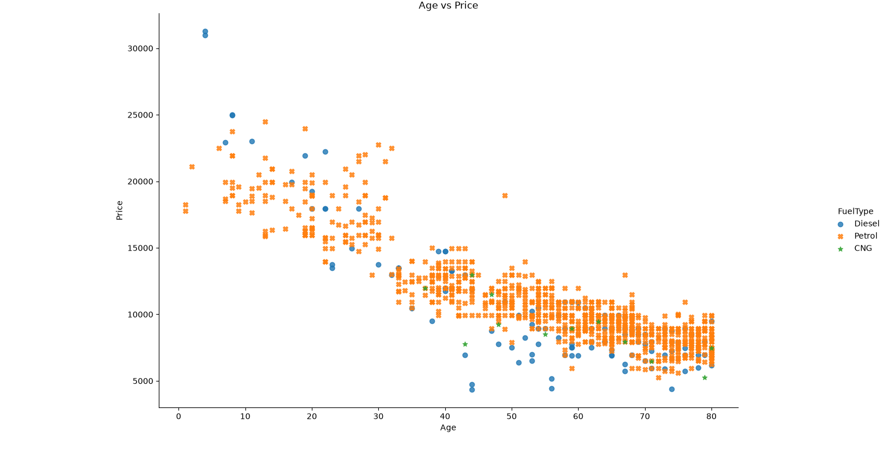

# 📊 Day 07 - Seaborn lmplot

## 🎯 Objective

Learn how to create an `lmplot` using Seaborn to visualize the relationship between car age and price while comparing different fuel types.

## 📚 Topics Covered

- Seaborn `lmplot()`
- `hue`
- `fit_reg`
- Regression lines
- Custom markers
- Seaborn color palettes
- Comparing categories in a visualization

## 🛠 Libraries Used

- Pandas
- Matplotlib
- Seaborn

## 📂 Dataset

Toyota.csv

## 💻 Python Code

**File:** `lmplot.py`

### 1. lmplot with Regression

```python
sns.lmplot(
    x='Age',
    y='Price',
    hue='FuelType',
    data=df,
    fit_reg=True,
    palette='Greens'
)

plt.title('Age vs Price')
plt.show()
```

This creates separate groups based on `FuelType` and displays regression lines.

### 2. lmplot with Different Markers

```python
sns.lmplot(
    x='Age',
    y='Price',
    hue='FuelType',
    data=df,
    fit_reg=False,
    markers=["o", "X", "*"],
    palette='tab10'
)

plt.title('Age vs Price')
plt.show()
```

Here, `fit_reg=False` removes the regression lines and different marker shapes are used for the fuel-type categories.

## 📊 Output

### lmplot with Regression


### lmplot with Different Markers



## 📖 Observation

The plots show the relationship between car age and price for different fuel types. Using `hue` makes it possible to distinguish the fuel-type categories within the same visualization.

The first plot includes regression lines, while the second plot displays the data points using different marker shapes without regression lines.

## 📌 What I Learned Today

- How to use Seaborn's `lmplot()`.
- How `hue` can be used to separate categories.
- How `fit_reg` controls the regression line.
- How to use different markers for categories.
- How to use Seaborn color palettes.

## 📅 Day 07 Status

✅ Completed
