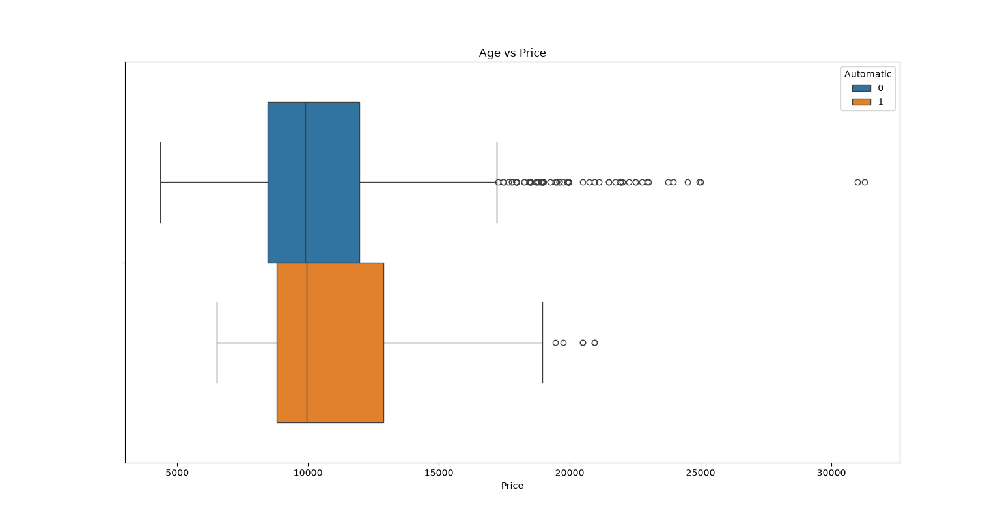
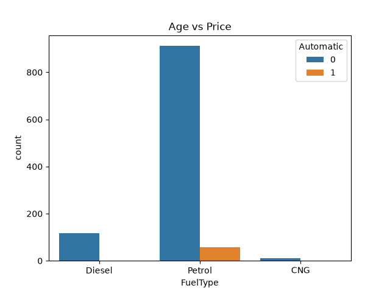

# 📊 Day 08 - Box Plot and Count Plot

## 🎯 Objective

Learn how to create Box Plots and Count Plots using Seaborn for analyzing numerical and categorical data.

---

## 📚 Topics Covered

- Seaborn Box Plot
- Seaborn Count Plot
- Visualizing numerical data distribution
- Comparing values across categories
- Counting categorical observations
- Understanding potential outliers using Box Plot

---

## 🛠 Libraries Used

- Pandas
- NumPy
- Matplotlib
- Seaborn

---

## 📂 Dataset

**Toyota.csv**

The Toyota dataset was used for creating the visualizations.

---

## 💻 Python Code

**File:** `box_count_plot.py`

The dataset was loaded using Pandas and missing values were removed using `dropna()`.

### Box Plot

```python
sns.boxplot(
    x='FuelType',
    y='Price',
    data=df
)

plt.title('Price vs Fuel Type')
plt.show()
```

The Box Plot was used to compare the distribution of car prices across different fuel types.

### Count Plot

```python
sns.countplot(
    x='FuelType',
    data=df
)

plt.title('Fuel Type Count')
plt.show()
```

The Count Plot was used to visualize the number of cars belonging to each fuel type.

---

## 📊 Output

### Box Plot



### Count Plot



---

## 📖 Observation

The Box Plot shows the distribution of car prices for different fuel types. It helps visualize the median, spread, and potential outliers in the data.

The Count Plot shows the number of cars available for each fuel type and makes it easy to compare the frequency of the categories.

---

## 📌 What I Learned Today

- How to create a Box Plot using `sns.boxplot()`.
- How to create a Count Plot using `sns.countplot()`.
- How Box Plots can be used to understand the distribution and spread of numerical data.
- How Count Plots can be used to visualize categorical data.
- How Seaborn makes it easier to create statistical visualizations.

---

## 📅 Day 08 Status

✅ Completed
