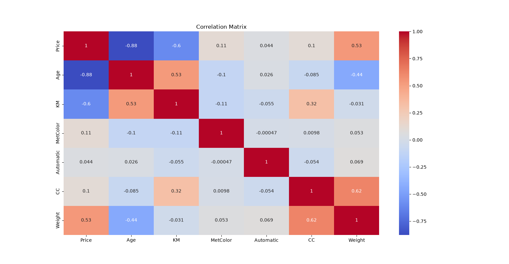

# 🔥 Day 09 - Heatmap

## 🎯 Objective

Learn how to create a Heatmap using Seaborn to visualize the correlation between numerical variables in the Toyota dataset.

---

## 📚 Topics Covered

- Correlation
- Correlation Matrix
- Selecting numerical columns
- `corr()`
- Seaborn `heatmap()`
- `annot=True`
- Color mapping using `cmap`

---

## 🛠 Libraries Used

- Pandas
- NumPy
- Matplotlib
- Seaborn

---

## 📂 Dataset

**Toyota.csv**

---

## 💻 Python Code

**File:** `heatmap.py`

```python
corr_matrix = df.select_dtypes(include=[np.number]).corr()

plt.figure(figsize=(10, 8))

sns.heatmap(
    corr_matrix,
    annot=True,
    cmap="coolwarm"
)

plt.title("Correlation Matrix")
plt.show()
```

---

## 📊 Output



---

## 📖 Observation

The heatmap represents the correlation between the numerical variables in the dataset. The correlation values and colors make it easier to identify positive and negative relationships between variables.

---

## 📌 What I Learned Today

- How to select numerical columns from a DataFrame.
- How to calculate a correlation matrix using `corr()`.
- How to create a heatmap using Seaborn.
- How `annot=True` displays correlation values inside the heatmap.
- How colors can help visualize the strength and direction of correlations.

---

## 📅 Day 09 Status

✅ Completed
