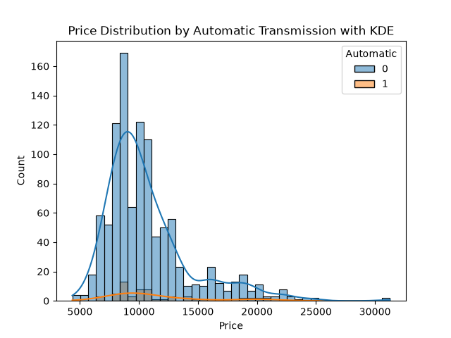

# 📊 Day 10 - Seaborn Histplot

## 🎯 Objective

Learn how to create histograms using Seaborn and understand the difference between a histogram with and without KDE.

## 📚 Topics Covered

- Seaborn `histplot()`
- Histogram
- `hue`
- KDE
- `kde=True`
- Comparing distributions

## 🛠 Libraries Used

- Pandas
- Matplotlib
- Seaborn

## 📂 Dataset

**Toyota.csv**

## 💻 Python Code

**File:** `histplot.py`

### 1. Histogram Without KDE

```python
sns.histplot(
    x='Price',
    hue='Automatic',
    data=df
)

plt.title('Price Distribution by Automatic Transmission')
plt.show()
```

This displays the price distribution using histogram bars and separates the data based on the `Automatic` column.

### 2. Histogram With KDE

```python
sns.histplot(
    x='Price',
    kde=True,
    hue='Automatic',
    data=df
)

plt.title('Price Distribution by Automatic Transmission with KDE')
plt.show()
```

Setting `kde=True` adds a smooth density curve to the histogram.

## 📊 Output

### Without KDE


### With KDE



## 📖 Observation

The histogram shows the distribution of car prices and separates the observations based on whether the car has automatic transmission.

The version without KDE focuses on the frequency distribution using histogram bars. The version with KDE additionally provides a smooth representation of the distribution.

## 📌 What I Learned Today

- How to create a histogram using Seaborn's `histplot()`.
- How to use `hue` to compare categories.
- How to use `kde=True`.
- The difference between a histogram with and without KDE.
- How KDE can help visualize the shape of a distribution.

## 📅 Day 10 Status

✅ Completed
